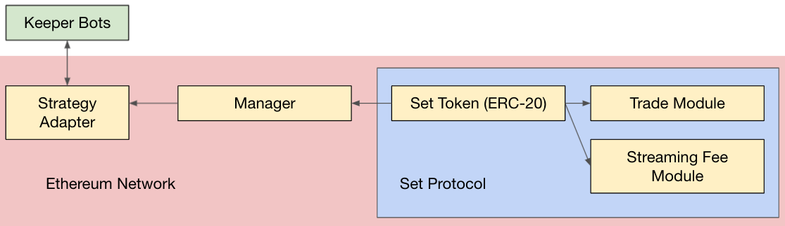

# ConsenSys Blockchain Developer Bootcamp 2021 Final Project

The [ConsenSys Blockchain Developer Bootcamp 2021](https://courses.consensys.net/courses/blockchain-developer-bootcamp-registration-2021) is ConsenSys Academy's flagship technical program. The course covers blockchain fundamentals, smart contracts (Solidity), developer tooling, and second order effects. The final project is to deploy a dApp with a set of smart contracts, tests, and a web interface. 

## Social Trading Set

This dApp will utilize [Set Protocol V2](https://docs.tokensets.com/) to create a smart contract managed [Social Trading](https://docs.tokensets.com/#social-trading) Set. The Manager will call the Trade Module to execute atomic trades and change the underlying collateral in a Set for all token holders. The Streaming Fee Module accrues streaming fees for the Manager. 


## Future Work: Algorithmic Trading Set

In future work, this dApp is looking to add an Algorithmic Trading Set. In this system a Strategy Adapter instructs the Manager on how to call the Trade Module when triggered by a Keeper Bot. 



## Directory Structure 

- `contracts`: `manager/SocialTradingManager.sol` is the main contract, which acts as the smart contract manager for the PBSocial token. `interfaces/ITradeModule.sol` is also custom. The rest of the contracts come from Set Protocol. 
- `diagrams`: Contract architecture diagrams used in the README.md
- `frontend`: Holds `dapp.js` which is the JavaScript for the front end. `index.html` lies outside this folder for Github Pages to recognize. 
- `migrations`: deployment scripts for truffle
- `test`: A handful of tests for the `SocialTradingManager` contract

```bash
blockchain-developer-bootcamp-final-project

├── contracts
│   ├── interfaces
│   ├──   ├── IExchangeAdapter.sol
│   ├──   ├── ISetToken.sol
│   ├──   ├── IStreamingFeeModule.sol
│   ├──   ├── ITradeModule.sol
│   ├── lib
│   ├──   ├── MutualUpgrade.sol
│   ├──   ├── PreciseUnitMath.sol
│   ├── manager
│   ├──   ├── SocialTradingManager.sol
│   ├── Migrations.sol

├── diagrams
│   ├── algorithmicTradingArchitecture.jpg
│   ├── socialTradingArchitecture.jpg


├── frontend
│   ├── dapp.js

├── migrations
│   ├── 1_initial_migration.js
│   ├── 2_social_trading_manager.js

├── test
│   ├── social_trading_manager.js

├── .gitignore
├── README.md
├── avoiding_common_attacks.md
├── deployed_address.txt
├── design_pattern_decisions.md
├── index.html
├── package-lock.json
├── package.json
├── truffle-config.js
```

## Frontend Interface

The frontend interface is hosted on Github Pages at [pblivin0x.github.io/blockchain-developer-bootcamp-final-project/](https://pblivin0x.github.io/blockchain-developer-bootcamp-final-project/)

## Ethereum Address for NFT Certificate

pblivin.eth (`0xD20673d9c07BaA5400B9DF075C3077DfE75A1a1F`)

## Installing Dependencies

### Node

```bash
npm install @openzeppelin/contracts@3.1.0
```

```bash
npm install @truffle/hdwallet-provider
```

```bash
npm install dotenv
```

## Running Smart Contract Unit Tests

```bash
truffle test
```

## Deployment Workflow

- In the "Social Trader" tab of the frontend, create a Set Token, yielding a new `setTokenAddress`
- Deploy the Social Trading Manager `truffle migrate --network kovan` with the new `setTokenAddress` in the constructor, yielding a new `socialTradingManagerAddress`
- Initialize the `BasicIssuanceModule`
- Initialize the `StreamingFeeModule` with the `socialTradingManagerAddress` as the fee recipient
- Initialize the `TradeModule`
- Update the Set Token Manager to `socialTradingManagerAddress`

## Acknowledgements
* [ConsenSys Academy](https://courses.consensys.net/)
* [Set Protocol](https://www.setprotocol.com/): [[Documentation](https://docs.tokensets.com/)] [[Github](https://github.com/SetProtocol/set-protocol-v2)] [[Index Coop Github](https://github.com/SetProtocol/index-coop-smart-contracts)][[FLI Technical Intro](https://docs.google.com/presentation/d/1oQcuKkcyNWZ7nO-IqY-tk9h3Vb4_lktX0AyfEwdxDNs)]
* [Truffle](https://trufflesuite.com/)
* [Paradigm MultiFaucet](https://faucet.paradigm.xyz/)
