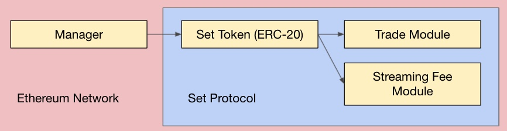

# ConsenSys Blockchain Developer Bootcamp 2021 Final Project

The [ConsenSys Blockchain Developer Bootcamp 2021](https://courses.consensys.net/courses/blockchain-developer-bootcamp-registration-2021) is ConsenSys Academy's flagship technical program. The course covers blockchain fundamentals, smart contracts (Solidity), developer tooling, and second order effects. The final project is to deploy a dApp with a set of smart contracts, tests, and a web interface. 

This dApp will utilize [Set Protocol V2](https://docs.tokensets.com/) to create a smart contract managed [Social Trading](https://docs.tokensets.com/#social-trading) Set. The Manager will call the Trade Module to execute atomic trades and rebalance the Set for all token holders. The Streaming Fee Module accrues streaming fees for the Manager. 



## Directory Structure 

```bash
blockchain-developer-bootcamp-final-project

├── contracts
│   ├── interfaces
│   ├──   ├── ISetToken.sol
│   ├── lib
│   ├──   ├── AddressArrayUtils.sol
│   ├── manager
│   ├──   ├── Manager.sol
│   ├── Migrations.sol

├── migrations
│   ├── 1_initial_migration.js

├── test

├── .gitignore
├── README.md
├── architecture.jpg
├── package-lock.json
├── package.json
├── truffle-config.js
```

## Frontend Access

The front-end will be hosted on Github Pages. 

## Ethereum Address

pblivin.eth

## Acknowledgements
* [ConsenSys Academy](https://courses.consensys.net/)
* [Set Protocol](https://www.setprotocol.com/): [[Documentation](https://docs.tokensets.com/)] [[Github](https://github.com/SetProtocol/set-protocol-v2)] [[Index Coop Github](https://github.com/SetProtocol/index-coop-smart-contracts)][[FLI Technical Intro](https://docs.google.com/presentation/d/1oQcuKkcyNWZ7nO-IqY-tk9h3Vb4_lktX0AyfEwdxDNs)]
* [Truffle](https://trufflesuite.com/)
